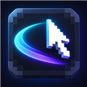

# Guía de Fluid UI

Fluid UI añade animaciones al inventario y al HUD de Minecraft 26.1–26.3 (Fabric). Es **solo de cliente**: no cambia
el juego, solo cómo se dibuja, así que funciona en cualquier servidor.

Creado por TakumiStudios · Licencia MIT · [Código](https://github.com/AloneX15/fluid-ui)

## Requisitos

- Minecraft 26.1.x, 26.2.x o 26.3.x, Java 25.
- [Fabric Loader](https://fabricmc.net/use/) y Fabric API.
- Instalar solo en el cliente. En un servidor dedicado el mod no se carga.

## Animaciones

| Animación | Dónde | Opción |
|---|---|---|
| Selector que se desliza | Hotbar | `hotbarSelector`, `hotbarSpeed` |
| Zoom con rebote del ítem seleccionado | Hotbar | `hotbarItemZoom`, `hotbarItemScale` |
| Zoom de entrada del nombre del ítem | HUD | `itemNameZoom` |
| Crecer al pasar el ratón | Pantallas con slots | `hoverScale`, `hoverScaleAmount` |
| Destello diagonal sobre el ítem | Pantallas con slots | `hoverShine`, `shineInterval` |
| Balanceo con inercia del ítem en el cursor | Pantallas con slots | `carriedWiggle`, `wiggleStrength` |
| Estela de estrellitas (por rareza o encantamiento) | Pantallas con slots | `carriedParticles`, `particleDensity` |
| Ítems iguales que flotan | Pantallas con slots | `matchingFloat` |
| Filtrado suave de ítems escalados | Todas | `smoothItemScaling` |

Colores de las estrellitas: amarillo (poco común), aguamarina (raro), magenta (épico) y violeta (encantado).

## Cómo funciona

- **Tiempo real:** las animaciones avanzan con el reloj, no con los frames; se ven igual a 30 que a 240 FPS.
- **Lógica separada:** curvas, muelles, partículas y destello (`src/main`) no dependen de Minecraft y tienen tests
  JUnit. El dibujado está en `src/client` mediante mixins ([MIXINS.md](../MIXINS.md)).
- **A prueba de conflictos:** si una animación falla por otro mod, se desactiva sola y el juego sigue. `/fluidui reload`
  la reactiva.

## Configuración rápida

Archivo `config/fluid_ui.json`. Para aplicar cambios sin reiniciar: `/fluidui reload`. Para quitar todo el movimiento
(accesibilidad): `"enabled": false`. Detalle completo en [configuracion.md](configuracion.md).

## Icono

El icono (`src/main/resources/assets/fluid_ui/icon.png`, 128×128) es el que muestran Mod Menu, Modrinth y CurseForge.
Una copia para esta documentación está en `docs/img/icon.png`.

## Problemas frecuentes

| Problema | Solución |
|---|---|
| No veo ninguna animación | Revisa `"enabled"` en el config y ejecuta `/fluidui reload`. |
| Una animación dejó de funcionar | Se desactivó sola tras un error (mira `logs/latest.log`); `/fluidui reload`. |
| Conflicto con otro mod | Abre un [issue](https://github.com/AloneX15/fluid-ui/issues) con el log. |
